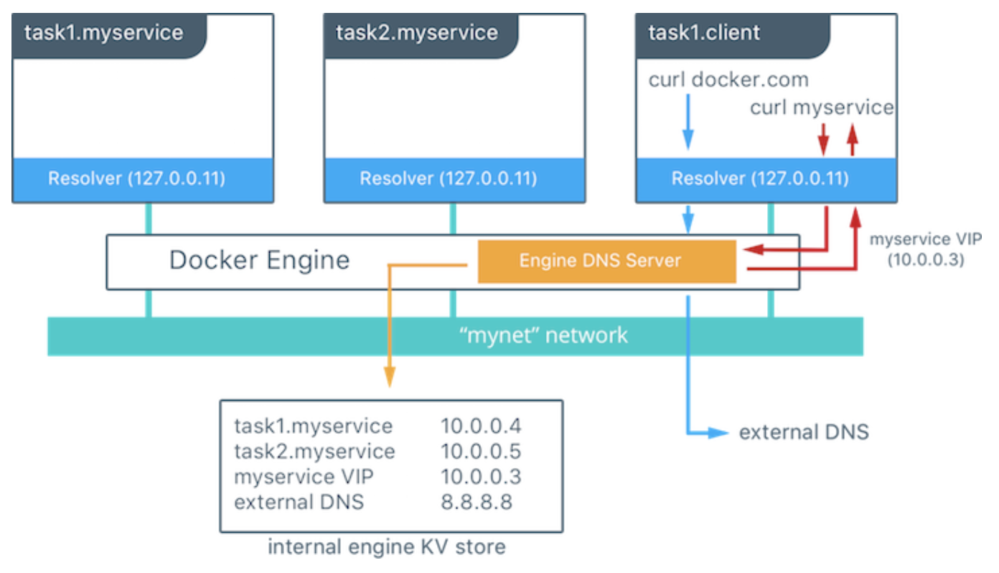

## Pinger

Used to deploy a server/client that polls a list of endpoints, and also accepts polls from each of them. This leads to a "mesh" topology whereby each 
relies on a functioning overlay network, and its DNS service. All connections are logged to stderr as well as (optional) Graylog. This makes it
trivial to spot when containers within an overlay network lose their ability to talk to each other.

There are lots of issues which have plagued Docker Swarm overlay networks, especially when using encryption - and this simply helps to pin-point 
where the issue lies. This issue is very hard to diagnose by looking at application logs from other containers. The diagram below shows how docker dns works:



This code works by deploying a "pinger" service onto each node in the swarm, and each of these will discover the others of its kind (same stack) and start to attempt to:  

- resolve the partner(s) address (this verifies dns)
- connect to each partner's http listener

once done, it will send a status log entry for each - showing either an error, or an ok. This means that within your logging solution (or just the service's logs) it is easy to see whether the underlying overlay network is experiencing issues. These issues include things such as:  

- dns hangs
- connection attempts to known addresses fail

### setup

The only requirements are that you modify the ".env" and "docker-compose.yaml" files before deploying the stack into your swarm. Just follow the comments within the respective files.


### syntax

docker stack deploy --compose-file docker-compose.yaml testpinger

gives:

```
<admin>$ docker stack deploy --compose-file docker-compose.yaml testpinger
Creating network testpinger_my-test-bridge
Creating service testpinger_pinger
```
view the service:
```
<admin>$docker service ps testpinger_pinger
ID                  NAME                  IMAGE                      NODE                DESIRED STATE       CURRENT STATE           ERROR               PORTS
lohmi5w7ypkf        testpinger_pinger.1   nicgrobler/pinger:v1.0.0   docker-desktop      Running             Running 5 minutes ago
cppf5llddb7j        testpinger_pinger.2   nicgrobler/pinger:v1.0.0   docker-desktop      Running             Running 5 minutes ago
i2j6tddgnke8        testpinger_pinger.3   nicgrobler/pinger:v1.0.0   docker-desktop      Running             Running 5 minutes ago
```
view logs:
```
<admin>$docker service logs -f testpinger_pinger
testpinger_pinger.1.lohmi5w7ypkf@docker-desktop    | time="2020-02-27T15:58:49Z" level=info msg="logging to stderr only - no graylog url supplied"
testpinger_pinger.1.lohmi5w7ypkf@docker-desktop    | time="2020-02-27T15:58:49Z" level=info msg="http listener on: 0.0.0.0:8111"
testpinger_pinger.1.lohmi5w7ypkf@docker-desktop    | time="2020-02-27T15:58:49Z" level=info msg="starting clients..."
testpinger_pinger.3.i2j6tddgnke8@docker-desktop    | time="2020-02-27T15:58:49Z" level=info msg="starting clients..."
testpinger_pinger.3.i2j6tddgnke8@docker-desktop    | time="2020-02-27T15:58:49Z" level=info msg="logging to stderr only - no graylog url supplied"
testpinger_pinger.3.i2j6tddgnke8@docker-desktop    | time="2020-02-27T15:58:49Z" level=info msg="http listener on: 0.0.0.0:8111"
testpinger_pinger.2.cppf5llddb7j@docker-desktop    | time="2020-02-27T15:58:49Z" level=info msg="starting clients..."
testpinger_pinger.2.cppf5llddb7j@docker-desktop    | time="2020-02-27T15:58:49Z" level=info msg="http listener on: 0.0.0.0:8111"
testpinger_pinger.2.cppf5llddb7j@docker-desktop    | time="2020-02-27T15:58:49Z" level=info msg="logging to stderr only - no graylog url supplied"
testpinger_pinger.3.i2j6tddgnke8@docker-desktop    | time="2020-02-27T15:58:59Z" level=info msg="ok:http://testpinger_pinger.2.cppf5llddb7j7asz2up0679li.testpinger_my-test-bridge:8111/ping - returned ok"
testpinger_pinger.2.cppf5llddb7j@docker-desktop    | time="2020-02-27T15:58:59Z" level=info msg="ok:http://testpinger_pinger.1.lohmi5w7ypkfajvx1upsgk2o8.testpinger_my-test-bridge:8111/ping - returned ok"
testpinger_pinger.2.cppf5llddb7j@docker-desktop    | time="2020-02-27T15:58:59Z" level=info msg="ok:http://testpinger_pinger.3.i2j6tddgnke8ag1mhbchwyvtq.testpinger_my-test-bridge:8111/ping - returned ok"
testpinger_pinger.1.lohmi5w7ypkf@docker-desktop    | time="2020-02-27T15:58:59Z" level=info msg="ok:http://testpinger_pinger.3.i2j6tddgnke8ag1mhbchwyvtq.testpinger_my-test-bridge:8111/ping - returned ok"
testpinger_pinger.1.lohmi5w7ypkf@docker-desktop    | time="2020-02-27T15:58:59Z" level=info msg="ok:http://testpinger_pinger.2.cppf5llddb7j7asz2up0679li.testpinger_my-test-bridge:8111/ping - returned ok"
testpinger_pinger.3.i2j6tddgnke8@docker-desktop    | time="2020-02-27T15:59:09Z" level=info msg="ok:http://testpinger_pinger.1.lohmi5w7ypkfajvx1upsgk2o8.testpinger_my-test-bridge:8111/ping - returned ok"
testpinger_pinger.3.i2j6tddgnke8@docker-desktop    | time="2020-02-27T15:59:09Z" level=info msg="ok:http://testpinger_pinger.2.cppf5llddb7j7asz2up0679li.testpinger_my-test-bridge:8111/ping - returned ok"
testpinger_pinger.2.cppf5llddb7j@docker-desktop    | time="2020-02-27T15:59:09Z" level=info msg="ok:http://testpinger_pinger.3.i2j6tddgnke8ag1mhbchwyvtq.testpinger_my-test-bridge:8111/ping - returned ok"
testpinger_pinger.2.cppf5llddb7j@docker-desktop    | time="2020-02-27T15:59:09Z" level=info msg="ok:http://testpinger_pinger.1.lohmi5w7ypkfajvx1upsgk2o8.testpinger_my-test-bridge:8111/ping - returned ok"
testpinger_pinger.1.lohmi5w7ypkf@docker-desktop    | time="2020-02-27T15:59:09Z" level=info msg="ok:http://testpinger_pinger.3.i2j6tddgnke8ag1mhbchwyvtq.testpinger_my-test-bridge:8111/ping - returned ok"
testpinger_pinger.1.lohmi5w7ypkf@docker-desktop    | time="2020-02-27T15:59:09Z" level=info msg="ok:http://testpinger_pinger.2.cppf5llddb7j7asz2up0679li.testpinger_my-test-bridge:8111/ping - returned ok"
<admin>$
```
finally, to stop:
```
<admin>$docker stack rm testpinger
Removing service testpinger_pinger
Removing network testpinger_my-test-bridge
```
